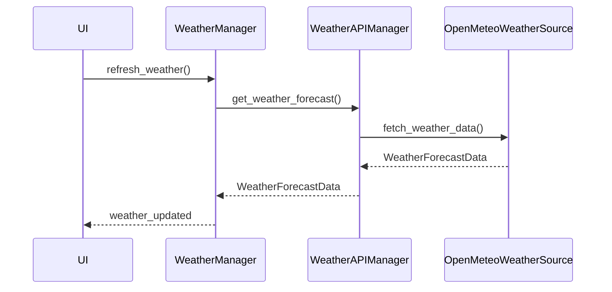

# Trainer API Integrations

This document lists the **real external integrations** present in the repository today.

- Overview: [`docs/ARCHITECTURE.md`](docs/ARCHITECTURE.md:1)
- Inventory: [`docs/codebase-inventory.md`](docs/codebase-inventory.md:1)

---

## Weather: Open‑Meteo

**Modules**

- adapter + caching: [`python.WeatherAPIManager`](src/api/weather_api_manager.py:328)
- source/parser: [`python.OpenMeteoWeatherSource`](src/api/weather_api_manager.py:89)

**Control flow**

- The UI triggers refresh via [`python.WeatherManager.refresh_weather()`](src/managers/weather_manager.py:279).
- WeatherManager delegates to WeatherAPIManager, which calls OpenMeteoWeatherSource.
- Results are emitted back to the UI via manager signals.

---

## Geocoding

The repository contains a geocoding service module:

- [`src/services/geocoding_service.py`](src/services/geocoding_service.py:1)

This is used (where enabled) to translate a configured location into coordinates for weather requests.

---

## Astronomy / moon phase

Moon phase is implemented as a service:

- [`python.HybridMoonPhaseService`](src/services/moon_phase_service.py:1)

Orchestrated by:

- [`python.AstronomyManager`](src/managers/astronomy_manager.py:1)

Note: `AstronomyManager` is composed by the application bootstrap in [`python.bootstrap_app()`](src/app/bootstrap.py:80); helpers/factories in `src/managers/*_factory.py` are intentionally restricted by Phase-2 policy.

---

## Trains

There is **no external live trains API adapter** in `src/api/**` at present. Train display can operate in synthetic/offline mode via [`python.TrainDataService`](src/managers/services/train_data_service.py:18).

---

## Cross-cutting

- Config models (keys, defaults, validation): [`src/managers/config_models.py`](src/managers/config_models.py:1)
- Shutdown is best-effort via the bootstrap container (see [`python.ApplicationContainer.shutdown()`](src/app/bootstrap.py:52)).
