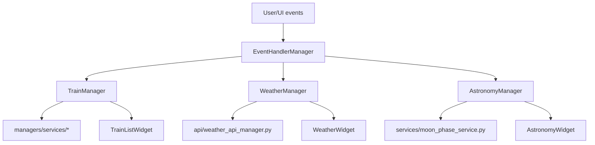
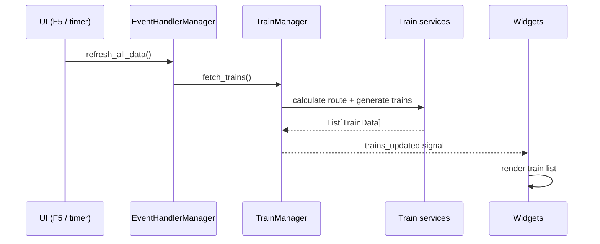
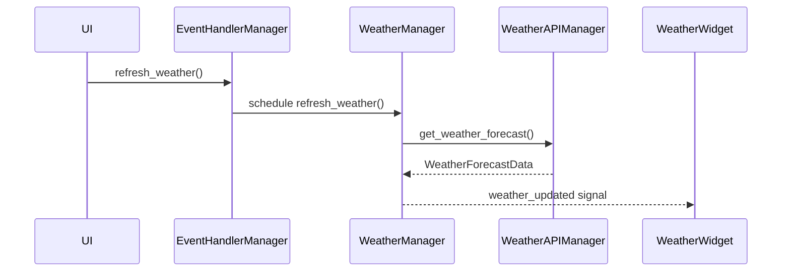

# Trainer Data Flow

This document describes the primary runtime data flows: trains, weather, astronomy, and configuration.

- Architecture overview: [`docs/ARCHITECTURE.md`](docs/ARCHITECTURE.md:1)
- Canonical inventory: [`docs/codebase-inventory.md`](docs/codebase-inventory.md:1)

---

## 1. Big picture

Data flows broadly like this:

1. UI triggers an action (startup refresh, timer refresh, keyboard shortcut)
2. A manager orchestrates work and emits signals
3. Services/adapters fetch/compute
4. UI widgets update from signals

---

## 2. Startup flow

Startup sequencing is anchored in [`main.py`](main.py:1): config load → composition → UI wiring → initial refresh.

Notable behaviour:

- A one-shot weather refresh is triggered after widgets are wired to avoid waiting for the 30-minute weather timer (see callbacks in [`main.py`](main.py:1)).

---

## 3. Manual refresh (F5 / Ctrl+R)

Keyboard shortcuts:

- handled by [`python.EventHandlerManager.handle_keyboard_shortcuts()`](src/ui/managers/event_handler_manager.py:354)
- invoked from `MainWindow.keyPressEvent`

Refresh fan-out:

- trains: `TrainManager.fetch_trains()`
- weather: schedules `WeatherManager.refresh_weather()`
- astronomy: schedules astronomy refresh (if enabled)

---

## 4. Train flow

### Trigger → fetch → UI update

Notes:

- `TrainManager` uses a queue/lock approach to ensure multiple refresh requests coalesce (see [`python.TrainManager.fetch_trains()`](src/managers/train_manager.py:130)).
- Synthetic/offline trains are generated deterministically (per minute bucket) to reduce visual jitter on refresh (see [`python.TrainDataService._build_deterministic_rng()`](src/managers/services/train_data_service.py:98)).

---

## 5. Weather flow

### Trigger → async refresh → UI update

The adapter implementation is in [`python.WeatherAPIManager`](src/api/weather_api_manager.py:328) and the Open-Meteo source/parser is [`python.OpenMeteoWeatherSource`](src/api/weather_api_manager.py:89).

---

## 6. Astronomy flow

Astronomy mirrors the weather shape: manager owns state + signals; services compute/fetch.

- orchestrator: [`python.AstronomyManager`](src/managers/astronomy_manager.py:1)
- moon phase service: [`python.HybridMoonPhaseService`](src/services/moon_phase_service.py:1)

---

## 7. Configuration flow

Configuration is loaded early and propagated to managers/widgets.

- models: [`src/managers/config_models.py`](src/managers/config_models.py:1)
- config manager: [`python.ConfigManager`](src/managers/config_manager.py:1)

Runtime changes are usually initiated via UI dialogs (see [`python.SettingsDialogManager`](src/ui/managers/settings_dialog_manager.py:16)).
