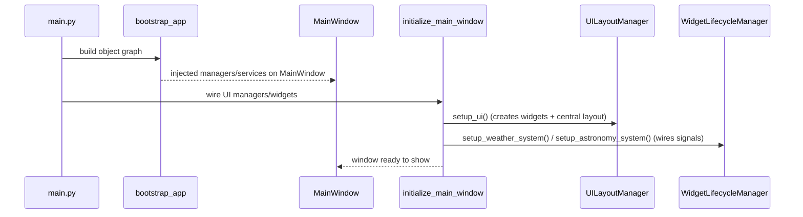

# Trainer UI Architecture

This document describes how the PySide6/Qt UI is structured today.

For a complete module-by-module inventory, see the canonical doc: [`docs/codebase-inventory.md`](docs/codebase-inventory.md:1).

---

## 1. UI boundaries (Phase 2)

- Qt imports are intended to live in `src/ui/**` with a small allowlist enforced by [`tests/test_qt_import_constraints.py`](tests/test_qt_import_constraints.py:43).
- The UI is *wired* (but not composed) via [`python.initialize_main_window()`](src/ui/main_window_components/initialization.py:30).
- Long-lived managers/services are constructed in the composition root: [`python.bootstrap_app()`](src/app/bootstrap.py:80).

---

## 2. Top-level UI structure

### Main window

The main UI shell is [`python.MainWindow`](src/ui/main_window_refactored.py:69). It is responsible for:

- hosting the central layout
- exposing compatibility properties for legacy call sites (e.g. `window.weather_widget`)
- delegating most UI work to dedicated “UI managers”
- delegating keyboard shortcuts to the event handler manager via `keyPressEvent`

### UI managers (composition inside the UI layer)

The main window is split into managers to keep responsibilities narrow:

- layout + widget creation: [`python.UILayoutManager`](src/ui/managers/ui_layout_manager.py:23)
- widget init/visibility + signal wiring: [`python.WidgetLifecycleManager`](src/ui/managers/widget_lifecycle_manager.py:16)
- refresh timers, close handling, keyboard shortcuts: [`python.EventHandlerManager`](src/ui/managers/event_handler_manager.py:19)
- settings dialogs orchestration: [`python.SettingsDialogManager`](src/ui/managers/settings_dialog_manager.py:16)

These are instantiated during UI wiring in [`python.initialize_main_window()`](src/ui/main_window_components/initialization.py:30).

---

## 3. Key widgets

### Train list

- Widget: [`python.TrainListWidget`](src/ui/widgets/train_list_widget.py:21)
- Child items: [`python.TrainItemWidget`](src/ui/widgets/train_item_widget.py:1)
- Route dialog: [`python.RouteDisplayDialog`](src/ui/widgets/route_display_dialog.py:1)

The train list uses Qt signals to communicate selection and “route details” intent back upward.

### Weather

- Widget: [`python.WeatherWidget`](src/ui/weather_components/weather_widget.py:21)
- The widget is created by [`python.UILayoutManager`](src/ui/managers/ui_layout_manager.py:23) and wired to the weather stack by [`python.WidgetLifecycleManager.setup_weather_system()`](src/ui/managers/widget_lifecycle_manager.py:44).

### Astronomy

- Widget: [`python.AstronomyWidget`](src/ui/astronomy_components/astronomy_widget.py:1)
- Wired in [`python.WidgetLifecycleManager.setup_astronomy_system()`](src/ui/managers/widget_lifecycle_manager.py:99).

For deeper widget details, see [`docs/widget-system.md`](docs/widget-system.md:1).

---

## 4. Lifecycle: from process start to visible window

At runtime, `main.py` drives a splash/startup sequence, then the main window is wired and shown.

UI wiring is intentionally defensive against “early signals” (e.g. train updates arriving before the window is visible). The layout manager explicitly parents widgets early (see [`python.UILayoutManager.setup_main_layout()`](src/ui/managers/ui_layout_manager.py:65)).

---

## 5. Refresh + keyboard shortcuts

### Shortcuts

Keyboard shortcuts are handled by [`python.EventHandlerManager.handle_keyboard_shortcuts()`](src/ui/managers/event_handler_manager.py:354) and invoked from `MainWindow.keyPressEvent`.

Supported shortcuts include:

- `F5`: refresh all data
- `Ctrl+R`: refresh all data
- `Ctrl+Q`: quit

### Refresh responsibilities

`refresh_all_data()` triggers:

- a train refresh via `TrainManager.fetch_trains()` (manager/service boundary)
- a weather refresh via scheduling `WeatherManager.refresh_weather()`
- an astronomy refresh (if enabled)

---

## 6. Settings dialogs

The settings dialogs are owned by `src/ui/*_settings_dialog.py` and orchestrated via [`python.SettingsDialogManager`](src/ui/managers/settings_dialog_manager.py:16). The settings manager is responsible for:

- ensuring dialogs are single-instance (not opened multiple times)
- applying config updates and triggering refresh when needed
