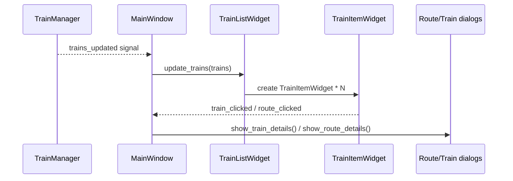

# Trainer Widget System

This document describes the core UI widgets and how they interact.

- High-level architecture: [`docs/ARCHITECTURE.md`](docs/ARCHITECTURE.md:1)
- UI architecture: [`docs/ui-architecture.md`](docs/ui-architecture.md:1)

---

## 1) Train widgets (`src/ui/widgets/**`)

### Train list

The primary train display is [`python.TrainListWidget`](src/ui/widgets/train_list_widget.py:21) (a `QScrollArea`). It is responsible for:

- owning the scroll container + internal `QVBoxLayout`
- creating per-train items
- managing a custom scrollbar
- emitting user intent via signals

Signals:

- `train_selected`: emitted when the user clicks a train
- `route_selected`: emitted when the user requests route details

Update path:

- The main window delegates rendering to [`python.TrainListWidget.update_trains()`](src/ui/widgets/train_list_widget.py:106).

Performance note:

- `update_trains()` disables updates while inserting widgets to reduce flicker and avoid geometry-update crashes during startup transitions.

### Train item widget

Each row is a [`python.TrainItemWidget`](src/ui/widgets/train_item_widget.py:1). It:

- renders one `TrainData`
- emits “train clicked” / “route clicked” signals upward

### Route details dialog

Route details are displayed via [`python.RouteDisplayDialog`](src/ui/widgets/route_display_dialog.py:1) and shown through the helper [`python.show_route_details()`](src/ui/main_window_components/details_dialogs.py:28).

---

## 2) Weather widget (`src/ui/weather_components/**`)

[`python.WeatherWidget`](src/ui/weather_components/weather_widget.py:21) is a UI-only widget that:

- renders the current forecast
- shows loading/error state
- emits UI intent signals (refresh / open settings)

Wiring:

- created in [`python.UILayoutManager`](src/ui/managers/ui_layout_manager.py:23)
- signals connected in [`python.WidgetLifecycleManager.setup_weather_system()`](src/ui/managers/widget_lifecycle_manager.py:44)

---

## 3) Astronomy widget (`src/ui/astronomy_components/**`)

[`python.AstronomyWidget`](src/ui/astronomy_components/astronomy_widget.py:1) follows the same shape as weather:

- UI-only rendering + status
- signals wired in [`python.WidgetLifecycleManager.setup_astronomy_system()`](src/ui/managers/widget_lifecycle_manager.py:99)

---

## 4) Theme application

Theme selection is managed by `ThemeManager` on the main window and applied through UI helpers.

At widget level:

- train widgets apply theme via their stylesheet/theme helpers (see theme utilities referenced by [`python.TrainListWidget`](src/ui/widgets/train_list_widget.py:21))

---

## 5) End-to-end widget interaction (trains)

---

## 6) Practical debugging notes

- Startup timing can deliver data before the main window becomes visible. The layout manager parents widgets early to avoid dropped updates (see [`python.UILayoutManager.setup_main_layout()`](src/ui/managers/ui_layout_manager.py:65)).
- Keyboard refresh is routed through the main window override to [`python.EventHandlerManager.handle_keyboard_shortcuts()`](src/ui/managers/event_handler_manager.py:354).
