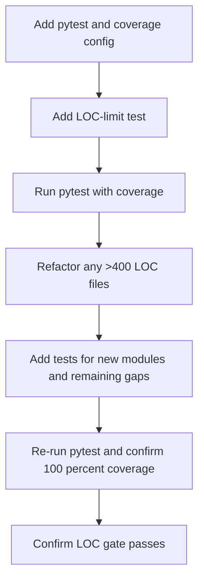

# Testing quality gates plan (100% coverage + <= 400 LOC)

## Goals

1. Enforce **100% unit test coverage** for the application package under [`src/`](src/__init__.py:1).
2. Enforce a **<= 400 LOC** rule for every Python file under [`src/`](src/__init__.py:1) and [`tests/`](tests/conftest.py:1), where LOC is **physical lines excluding blank lines only**.
3. If a file exceeds 400 LOC, **refactor by extracting smaller modules** (do not fight the limit inside the same oversized file).

Known current violations:

- [`src/ui/main_window.py`](src/ui/main_window.py:1) is ~2193 lines.
- [`src/ui/main_window_refactored.py`](src/ui/main_window_refactored.py:1) is ~803 lines.

## Scope rules

Included:

- `src/**/*.py` (including all UI: [`src/ui/`](src/ui/__init__.py:1))
- `tests/**/*.py`

Excluded from scans and gates:

- `venv/`, `docs/`, `assets/`, `licenses/`, `dist/`, `.pytest_cache/`, and other build artifacts
- repo-root scripts (for now): [`main.py`](main.py:1), [`build.py`](build.py:1), [`builddmg.py`](builddmg.py:1), [`build_flatpak.sh`](build_flatpak.sh:1), [`create_icon.py`](create_icon.py:1)

## Gate 1: 100% coverage

### Mechanism

- Add a repo-level [`pytest.ini`](pytest.ini:1) (or `pyproject.toml` later) to standardize test runs.
- Add a repo-level [`.coveragerc`](.coveragerc:1) to:
  - set `source = src`
  - enable branch coverage if desired
  - set `fail_under = 100`
  - show missing lines in reports

Recommended minimal defaults:

- `pytest` default options should include coverage collection for `src` and `--cov-fail-under=100`.
- Coverage exclusions should be strict; allow `# pragma: no cover` only for truly untestable lines (defensive `__repr__`, platform-guarded branches, and similar).

### UI coverage approach

Because `src/ui/**` is in-scope, tests will be a mix of:

- `pytest-qt` widget instantiation tests (already in use in [`tests/test_light_theme_contrast.py`](tests/test_light_theme_contrast.py:1)).
- Logic extraction from UI classes into small pure helpers that are easily unit-tested.

Principle: treat widget tests as **smoke-level unit tests** (signals, state transitions, stylesheet propagation) and keep complex business logic out of widgets.

## Gate 2: <= 400 LOC

### Mechanism

Add a test (suggested file: [`tests/test_loc_limit.py`](tests/test_loc_limit.py:1)) that:

1. Enumerates `src/**/*.py` and `tests/**/*.py`.
2. Skips excluded directories.
3. Counts **non-blank** lines.
4. Fails with a readable list of offenders (path + LOC), sorted descending.

This makes the LOC rule a normal unit-test gate that runs everywhere `pytest` runs.

### Refactor strategy for offenders

When a file is > 400 LOC:

1. Identify cohesive responsibilities.
2. Extract into new sibling modules.
3. Keep the original module as a thin facade or re-export layer if needed (similar to the pattern in [`src/ui/train_widgets.py`](src/ui/train_widgets.py:1)).
4. Add or update tests to cover the new modules.

For the known large windows:

- For [`src/ui/main_window.py`](src/ui/main_window.py:1): split into a package like `src/ui/main_window_components/` (already exists) and convert `main_window.py` into a small composition root.
- For [`src/ui/main_window_refactored.py`](src/ui/main_window_refactored.py:1): split into `src/ui/main_window_refactored_components/` or migrate remaining responsibilities into existing managers under [`src/ui/managers/`](src/ui/managers/__init__.py:1) and [`src/ui/main_window_components/`](src/ui/main_window_components/__init__.py:1).

## Execution workflow

## Acceptance criteria

- `pytest` fails if coverage for `src/**` is < 100%.
- `pytest` fails if any file in `src/**` or `tests/**` exceeds 400 non-blank lines.
- Large modules are refactored into smaller files, with tests proving behavior.

